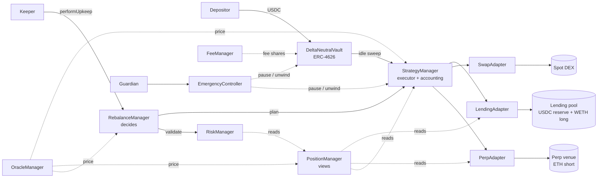
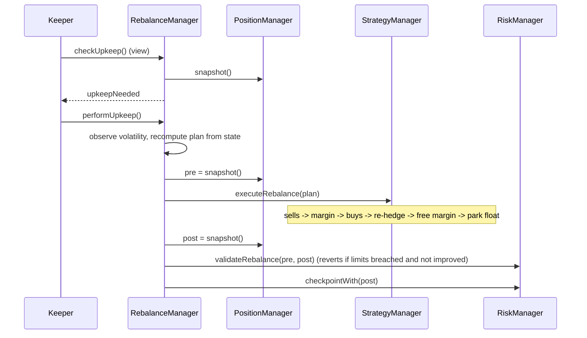
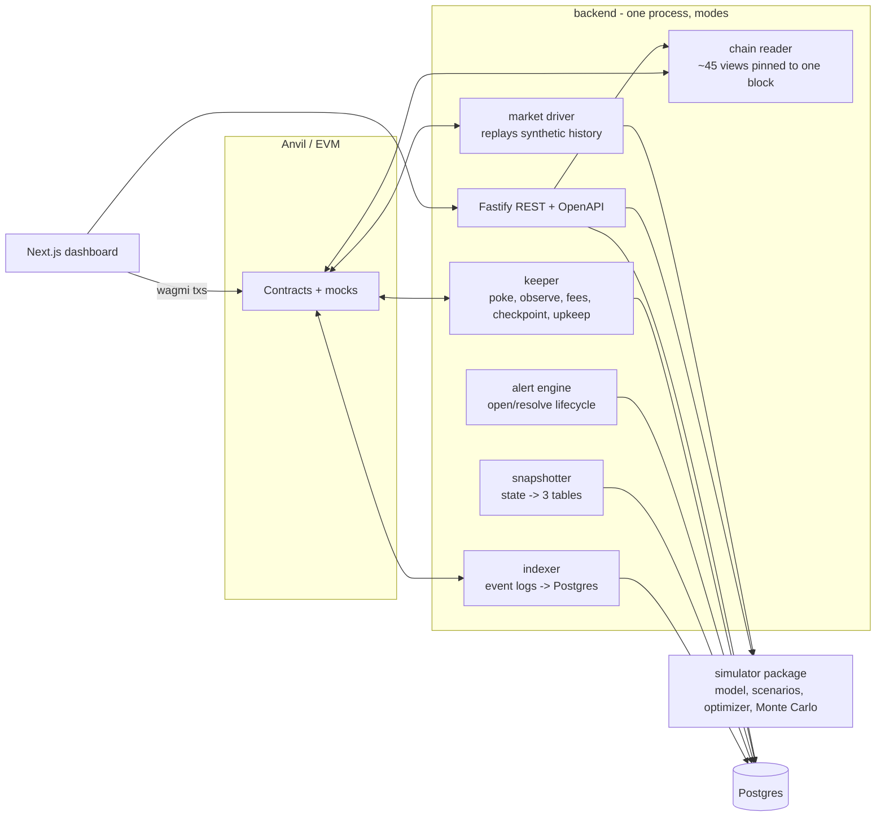

# Architecture

This document explains how the system is put together: the on-chain modules and why they are split
the way they are, how capital and control flow between them, and how the off-chain services sit on
top. Strategy economics live in [strategy.md](strategy.md); risk logic in
[risk-management.md](risk-management.md).

> Everything runs against **local mock markets** (lending pool, perpetual exchange, spot DEX, price
> feeds). The mocks implement the same interfaces a production integration would use; see
> "What is simulated vs production-shaped" at the end.

## 1. The system at a glance



| Module | Responsibility | State it owns |
|---|---|---|
| `DeltaNeutralVault` | ERC-4626 entry/exit, share accounting, fee minting, liquidity-bounded withdrawals, `redeemWithUnwind` | shares, deposit cap, wiring |
| `StrategyManager` | Executes every movement of strategy capital; spot-leg PnL counters | adapters, spot cost basis, net capital |
| `LendingAdapter` | Holds USDC reserve + WETH long on the lending pool; interest tracking | principal, interest checkpoints |
| `PerpAdapter` | Holds the perp account; mark-price entry for clean PnL attribution | mark entry, cumulative slippage |
| `SwapAdapter` | USDC <-> WETH routing | none |
| `PositionManager` | Read-only aggregation: snapshot, delta, liquidation report, PnL breakdown | none |
| `RebalanceManager` | Keeper entry point; decides whether/how to rebalance; EWMA volatility; strategist targets | targets, bands, vol estimate, cooldown |
| `RiskManager` | Risk classification, post-rebalance validation, drawdown peak, circuit breaker | risk config, peak share price, persisted state |
| `OracleManager` | Validated, normalised prices with fallback and shutdown | feed config, last good price |
| `FeeManager` | Management/performance/withdrawal fee maths and HWM | fee config, HWM, fee totals |
| `EmergencyController` | Pause flags, shutdown, emergency unwind | pause/shutdown flags |
| `AccessRegistry` | Single role registry for every module | roles |

Libraries: `PerpMath` (position maths shared by venue and adapter), `DeltaCalculator`, `Types`,
`GasGuard`.

## 2. Why this split

**Decide vs execute.** `RebalanceManager` computes plans; `StrategyManager` executes them. The executor
never chooses a target, and the planner never touches funds. That keeps each contract auditable on
its own and means a new planning policy can be deployed without touching the contract that holds the
positions.

**Views are a separate contract.** `PositionManager` is pure aggregation. The vault, risk engine,
rebalancer, backend and UI all consume the *same* snapshot struct, so there is exactly one definition
of "NAV", "delta" and "leverage" in the system.

**Adapters isolate venues.** Each external protocol sits behind a narrow interface
(`ILendingAdapter`, `IPerpAdapter`, `ISwapAdapter`). The lending interface uses the Aave V3 `supply` /
`withdraw` / `getReserveNormalizedIncome` signatures verbatim; swapping the mock for Aave means swapping
the balance/rate views for aToken and `getReserveData` reads. Adapters are immutable, bound to one
strategy (checked at `initialize`), and can only ever send funds back to that strategy.

**One role registry.** `AccessRegistry` holds every role; modules query it through the `Auth` mixin.
Rotating a compromised keeper is one transaction, not ten.

## 3. Capital layout

```
                     total NAV (N)
       ┌──────────────────┴─────────────────────┐
  USDC reserve R* = reserveBps · N          basis B* = N − R*
  (lending pool, liquid)              ┌───────────┴────────────┐
                                long L* = B*·lev/(lev+h)   perp equity E* = h·L*/lev
                                (WETH supplied to lending)  (USDC margin, short h·longQty)
```

With the defaults (10% reserve, 2x leverage, 100% hedge): **60% WETH long, 30% perp margin, 10% USDC
reserve**. The long leg earns WETH supply interest; the short earns funding; the reserve earns USDC
supply interest *and* is the liquidity buffer for withdrawals.

Delta ≈ 0 because the short is always re-hedged against the *actual* post-trade WETH quantity
(`StrategyManager.executeRebalance` step 4), not against a pre-computed target.

## 4. Flows

### Deposit

1. User calls `deposit`. The vault opens a **pricing window**: one `strategy.valuation()` call returns
   NAV, price dependence and oracle health; fees are crystallised against that NAV; the value is cached
   in transient storage (EIP-1153) for the limit check and preview.
2. The window closes *before* any token moves, then OZ `_deposit` transfers USDC in and mints shares.
3. The USDC sits idle in the vault until the next keeper tick sweeps it into the lending reserve and,
   if the allocation band is breached and the carry filter approves, into the basis trade.

Batching deployment in the keeper rather than on every deposit keeps deposits cheap (~248k gas) and
amortises trading costs across depositors.

### Rebalance



`performUpkeep` ignores `performData` and recomputes the plan on-chain, so a keeper can only choose
*when* a rebalance happens, never *what* it does. See [rebalancing.md](rebalancing.md).

### Withdraw

Standard `withdraw`/`redeem` are served from **liquid assets only**: vault idle, then the USDC reserve.
They never trade, and `maxWithdraw`/`maxRedeem` report exactly that liquidity (ERC-4626 compliant: max
functions must not over-promise). Exits larger than the buffer use `redeemWithUnwind`, which burns the
shares first, then unwinds a pro-rata slice of *both* legs and the margin, so delta and leverage are
unchanged for the remaining holders and the exiting user pays their own execution cost. The keeper
refills the reserve on its next rebalance.

### Emergency

The guardian can pause deposits, pause strategy trading, and call `emergencyUnwind(minSellPrice,
maxBuyPrice)`: close the hedge, withdraw margin, sell the long, pull the reserve, return every USDC to
the vault, enter a terminal shutdown. Each step is isolated with try/catch so one broken venue can't
trap funds in the others. Price bounds come from the guardian, so the unwind works with the oracle down.
After shutdown NAV is pure USDC and exits need no oracle at all.

## 5. Accounting conventions

- **NAV** = strategy float + USDC reserve (incl. accrued interest) + WETH x oracle price + max(perp
  equity, 0). Interest and funding are marked continuously, so there is no harvest step to sandwich.
- **`totalAssets()` never reverts.** If the oracle is unhealthy it values at the last good price; if a
  *venue* view reverts (paused reserve, bad upgrade) each leg falls back to adapter storage - the perp
  to local maths on the stored position, the lending leg to its last checkpointed balance - which
  understates rather than overstates NAV. Every *state-changing* share operation is still blocked while
  positions are open and the oracle is unhealthy (NAV unknown), and quoted liquidity drops to the idle
  float when the lending venue cannot be read. A gas-starved read reverts instead of being priced stale
  ([GasGuard](../contracts/libraries/GasGuard.sol)).
- **PnL attribution reconciles by construction:** `strategyNav − netCapital == netPnl` (see
  [pnl-accounting.md](pnl-accounting.md)); the invariant suite checks this after every random step.

## 6. Off-chain architecture



- **Reader** (`backend/src/chain/reader.ts`) reads ~45 view functions at one pinned block through a
  batched JSON-RPC transport, so a snapshot never mixes pre- and post-rebalance values.
- **Indexer** pulls logs in 2,000-block chunks and writes idempotently (`UNIQUE(tx_hash, log_index)`).
- **Snapshotter** flattens state into `vault_snapshots`, `position_snapshots`, `pnl_snapshots`.
- **Alert engine** evaluates pure rules against views built from on-chain thresholds.
- **Keeper** is a thin loop: every decision is made on-chain (see [rebalancing.md](rebalancing.md)).
- **Market driver** replays a simulator-generated market onto Anvil (time warps, oracle rounds,
  funding, utilisation, user flows, keeper ticks), so the dashboard's history is produced by the real
  contracts, not fabricated.
- **Simulator** (`simulator/`) is a float model that mirrors the contract maths to within a few basis
  points (parity tests pin it to on-chain numbers); it powers scenarios, APY estimation, the optimizer
  and Monte Carlo.

Timestamps in the database are **chain time**: the demo warps time to build history.

## 7. Deployment wiring

`script/ProtocolDeployer.sol` is the single source of truth for deployment and is used by *both* the
Forge deploy script and the test fixture, so tests run against exactly the configuration the demo ships
with. Circular dependencies (vault <-> strategy, strategy <-> adapters) are resolved with one-shot,
admin-gated `initialize` calls that revert on a second call.

## 8. What is simulated vs production-shaped

| Component | Here | Production equivalent | Gap |
|---|---|---|---|
| Lending pool | `MockLendingProtocol`: scaled balances, kinked rate curve, liquidity-limited withdrawals, virtual borrowers | Aave V3 / Compound / Morpho | Balance/rate views read aToken + reserve data; borrowers are real |
| Perp venue | `MockPerpetualMarket`: synchronous execution, funding index, IM/MM, liquidation, ADL hook; counterparty is an LP pool | GMX v2, Hyperliquid, dYdX, Synthetix | Async order flow (GMX), off-chain books (HL/dYdX) need a pending-order state machine in `PerpAdapter`; funding is set by the simulator, not derived from premium |
| Spot DEX | `MockSpotDEX`: oracle-priced RFQ with fee + linear impact | Uniswap v3 / aggregator | Real execution can deviate from oracle either way (the strategy already bounds it with oracle-derived min-out) |
| Price feeds | `MockAggregatorV3` (Chainlink ABI, round history) | Chainlink | Add L2 sequencer-uptime check; mark vs index basis |
| Keeper | Node loop with Anvil keys | Chainlink Automation / Gelato | Interface is already `checkUpkeep`/`performUpkeep`; plan is recomputed on-chain |
| Admin | EOA | TimelockController + multisig | Deploy script accepts any admin address |
| USDC | Assumed = $1 | Chainlink USDC/USD + depeg circuit breaker | See [threat-model.md](threat-model.md) |
